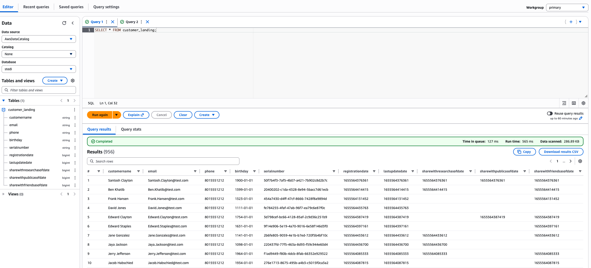
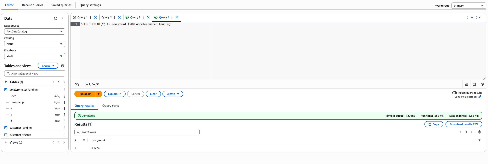
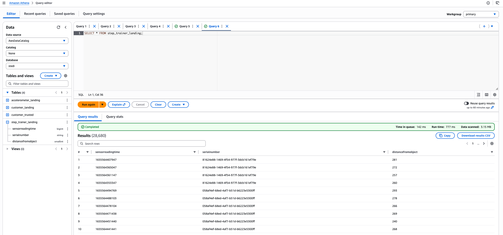
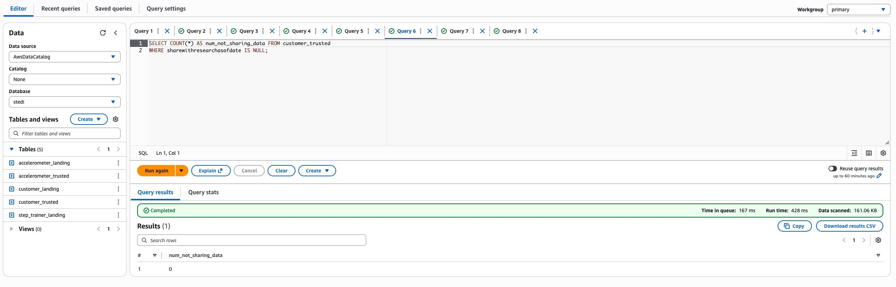
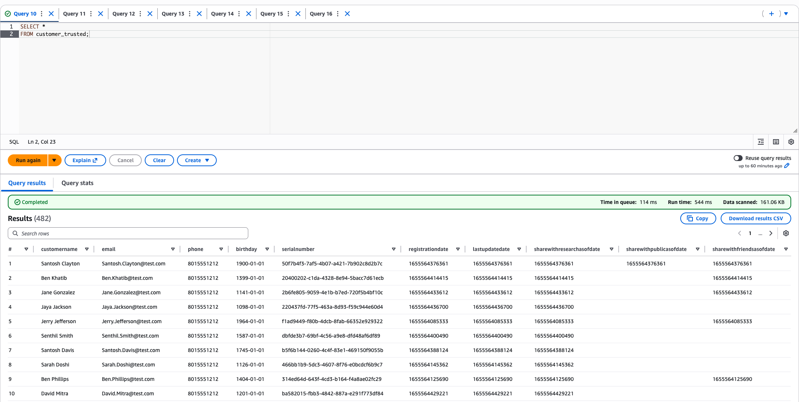
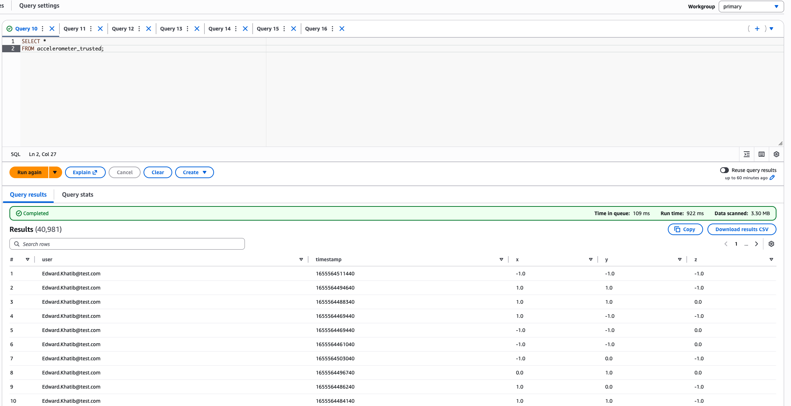
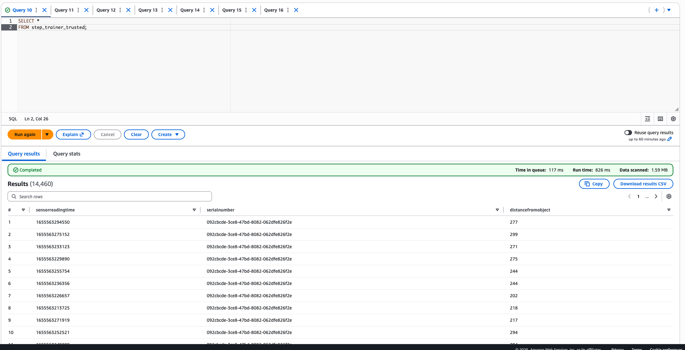
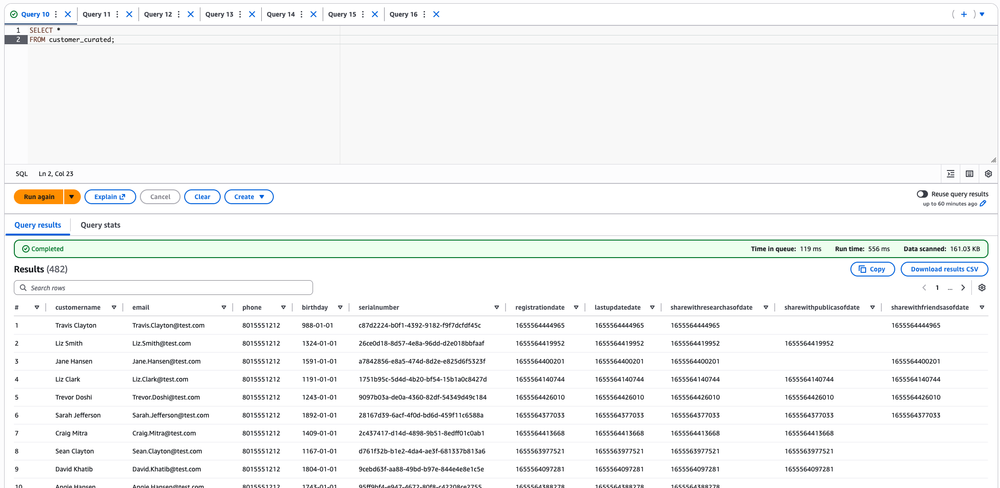
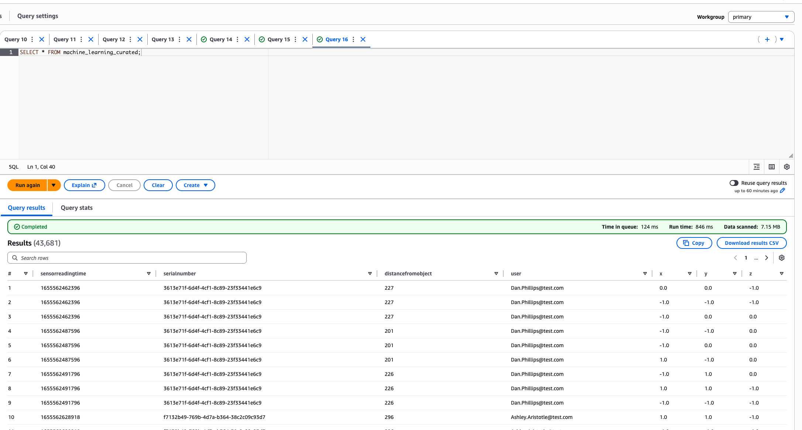

# STEDI Human Balance Analytics — AWS Glue Data Lakehouse

**Udacity Data Engineering with AWS | Project 3 of 4**

This project builds a cloud-native data lakehouse solution on AWS to process IoT sensor data from the STEDI Step Trainer device and its companion mobile app. The pipeline curates data through three progressive zones — Landing, Trusted, and Curated — before feeding a machine learning model that detects human balance steps in real time.

Privacy is a core constraint: only data from customers who have explicitly consented to research use flows into the ML training set.

---

## Business Context

The STEDI team manufactures a balance-training device that records motion sensor readings. Customers who purchase the device can opt in to share their data for research. The goal is to train an ML model on step data, but the pipeline must enforce consent at every stage to comply with privacy requirements.

A known data quality issue complicates things: a bug in the fulfillment website caused only 30 serial numbers to be reused across all customers. This means customer records cannot be naively joined to Step Trainer IoT records by serial number — the pipeline must account for this.

---

## Architecture

The solution follows a three-zone lakehouse pattern, each backed by a dedicated S3 prefix and catalogued in the AWS Glue Data Catalog:

```
S3 Raw Data                AWS Glue Jobs               AWS Glue Catalog
─────────────              ─────────────────            ────────────────
customer/landing/    ───►  customer_landing_to_trusted  customer_trusted
accelerometer/landing/ ──►  accel_landing_to_trusted    accelerometer_trusted
step_trainer/landing/  ──►  step_trainer_trusted        step_trainer_trusted
                             │
                             ▼
                       customer_trusted_to_curated ──►  customer_curated
                       machine_learning_curated    ──►  machine_learning_curated
```

| Zone | Purpose |
|------|---------|
| **Landing** | Raw data ingested from source systems, no filtering |
| **Trusted** | Filtered to consenting customers only; PII-safe joins |
| **Curated** | Aggregated, ML-ready dataset joining sensor + accelerometer readings |

---

## Technology Stack

- **AWS S3** — object storage for all three data zones
- **AWS Glue** — serverless Spark ETL jobs and Data Catalog
- **AWS Glue Studio** — visual job authoring with generated PySpark scripts
- **AWS Athena** — SQL querying against the Glue Catalog for validation
- **PySpark / Spark SQL** — distributed data transformations
- **Python** — all ETL logic

---

## Landing Zone

The landing zone holds raw, unfiltered data exactly as received from source systems. Three Glue Catalog tables were created manually using SQL DDL and registered against the S3 locations. Using proper data types (e.g., `bigint` for epoch timestamps, `float` for accelerometer axes) rather than defaulting everything to strings ensures downstream Spark joins behave correctly.

**DDL scripts:** [`sql/customer_landing.sql`](sql/customer_landing.sql) · [`sql/accelerometer_landing.sql`](sql/accelerometer_landing.sql) · [`sql/step_trainer_landing.sql`](sql/step_trainer_landing.sql)

### Customer Landing — 956 rows

Raw customer records including registration details and consent flags.



### Accelerometer Landing — 81,273 rows

Mobile app motion readings (X, Y, Z axes) keyed by user email and timestamp.



### Step Trainer Landing — 28,680 rows

IoT sensor distance readings keyed by serial number and sensor reading time.



---

## Trusted Zone

The trusted zone applies privacy filtering: only records tied to customers who have a non-null `shareWithResearchAsOfDate` are allowed through. Two Glue jobs implement this, and dynamic schema updates are enabled so the Glue Catalog stays in sync on every run.

### Job 1 — Customer Landing → Trusted

[`scripts/customer_landing_to_trusted.py`](scripts/customer_landing_to_trusted.py)

Reads from S3 and applies a Spark SQL filter to drop any customer who has not consented to research use:

```sql
SELECT * FROM myDataSource
WHERE sharewithresearchasofdate IS NOT NULL;
```

Result: **482 consenting customers** written to `customer/trusted/` and registered as `customer_trusted` in the Glue Catalog.





### Job 2 — Accelerometer Landing → Trusted

[`scripts/accelerometer-landing-to-trusted.py`](scripts/accelerometer-landing-to-trusted.py)

Joins accelerometer readings to `customer_trusted` on `user = email`, then keeps only the accelerometer columns — the customer PII is dropped:

```sql
SELECT user, timestamp, x, y, z
FROM myDataSource;
```

This pattern ensures that even if a customer later revokes consent, their accelerometer readings are not present in the trusted zone. Result: **40,981 rows**.



### Job 3 — Step Trainer Landing → Trusted

[`scripts/step_trainer_trusted.py`](scripts/step_trainer_trusted.py)

Joins Step Trainer IoT readings to `customer_curated` (see below) on `serialnumber` using SQL to avoid the Spark join issue caused by non-unique serial numbers:

```sql
SELECT sensorreadingtime, s.serialnumber, distancefromobject
FROM STLanding AS s
JOIN CCSource AS c
ON s.serialnumber = c.serialnumber;
```

Result: **14,460 rows** written to `step_trainer_trusted`.



---

## Curated Zone

The curated zone produces ML-ready tables. At this stage, data has been fully filtered for consent and cross-validated to ensure sensor records can be tied back to real consenting customers.

### Job 4 — Customer Trusted → Curated

[`scripts/customer_trusted_to_curated.py`](scripts/customer_trusted_to_curated.py)

Joins `customer_trusted` to `accelerometer_trusted` on email, then deduplicates with `SELECT DISTINCT` on customer columns only. This ensures the curated customer table only contains customers who have *both* consented to research *and* have actual accelerometer data on file:

```sql
SELECT DISTINCT customername, email, phone, birthday, serialnumber,
    registrationdate, lastupdatedate, sharewithresearchasofdate,
    sharewithpublicasofdate, sharewithfriendsasofdate
FROM myDataSource;
```

Result: **482 curated customers**.



### Job 5 — Machine Learning Curated (Final Dataset)

[`scripts/machine_learning_curated.py`](scripts/machine_learning_curated.py)

The final aggregation joins `step_trainer_trusted` to `accelerometer_trusted` on matching timestamps, producing a single record per sensor reading that includes both the distance measurement and the X/Y/Z accelerometer axes:

```sql
SELECT st.sensorreadingtime, st.serialnumber, st.distancefromobject,
       at.user, at.x, at.y, at.z
FROM at
JOIN st ON at.timestamp = st.sensorreadingtime;
```

This is the table the ML team consumes. Result: **43,681 training records**.



---

## Pipeline Results Summary

| Zone | Table | Row Count |
|------|-------|----------:|
| Landing | customer_landing | 956 |
| Landing | accelerometer_landing | 81,273 |
| Landing | step_trainer_landing | 28,680 |
| Trusted | customer_trusted | 482 |
| Trusted | accelerometer_trusted | 40,981 |
| Trusted | step_trainer_trusted | 14,460 |
| Curated | customer_curated | 482 |
| Curated | machine_learning_curated | 43,681 |

---

## Key Engineering Decisions

**SQL Query nodes over Join nodes in Glue Studio.** AWS Glue uses Apache Spark under the hood while Athena uses Presto. Non-unique join keys (duplicate serial numbers, repeated timestamps) behave differently between the two engines. Using `Transform - SQL Query` nodes throughout produces consistent, predictable output regardless of key uniqueness.

**Privacy enforced at the join boundary, not after.** Rather than filtering consent post-join, each trusted-zone job joins *to* the consenting customer table. This means no non-consenting user's data ever enters a joined dataset — it is excluded structurally, not just filtered away later.

**Dynamic schema updates enabled.** All Glue sink nodes set `updateBehavior="UPDATE_IN_DATABASE"` and `enableUpdateCatalog=True`, so the Glue Data Catalog schema stays synchronized with the data on every job run without manual intervention.

**Serial number deduplication handled via SQL join semantics.** The known fulfillment bug (30 serial numbers reused across all customers) is handled by joining Step Trainer IoT records to `customer_curated` rather than `customer_landing`, since the IoT stream carries the correct device serial numbers.

---

## Repository Structure

```
.
├── scripts/                          # PySpark Glue job scripts
│   ├── customer_landing_to_trusted.py
│   ├── accelerometer-landing-to-trusted.py
│   ├── customer_trusted_to_curated.py
│   ├── step_trainer_trusted.py
│   └── machine_learning_curated.py
├── sql/                              # Glue Catalog DDL for landing zone tables
│   ├── customer_landing.sql
│   ├── accelerometer_landing.sql
│   └── step_trainer_landing.sql
└── images/                           # Athena query screenshots for each zone
```
